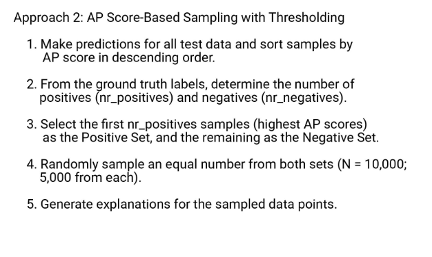
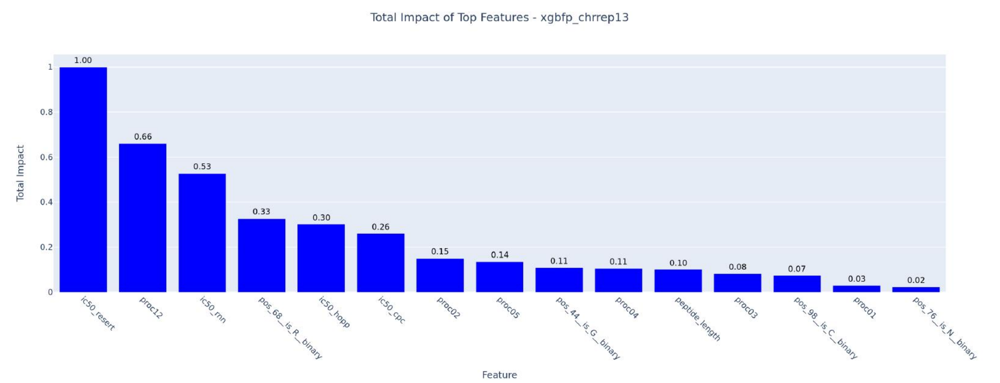

# Indit Intermediary Metrics

**links**
* task https://neconcoimmunity.atlassian.net/browse/ID-294?searchObjectId=23410&searchContainerId=10025&searchContentType=issue&searchSessionId=60960069-9596-4f46-8bd2-a6c67b508d70
* v2 model feature importance https://neconcoimmunity.atlassian.net/wiki/spaces/RD/pages/1249968165/Final+model+v2.0+-+Expressionless#Training-feature-importance
* process model documentation https://neconcoimmunity.atlassian.net/wiki/spaces/RD/pages/1460371500/Processing+Models+Patent

**task**
- [ ] Explore and familiarize yourself with output files on cepi9 for influenza protein in cursor file explorer

**maybe later**
- [ ] Set up a meeting with Peyman for the metrics
    - [ ] Come up with a draft list of metrics to include
    - [ ] Define a goal for the meeting with Peyman

## Meeting with Ghazal

## v2 AP models (paused ❌)
Is it time to upgrade to V2 models? 
Ghazal's recommended I read this to gauge the feature importance
for my metrics https://neconcoimmunity.atlassian.net/wiki/spaces/RD/pages/1249968165/Final+model+v2.0+-+Expressionless#Training-feature-importance.
It is for v2 models.

Should we discuss this in the meeting on Tuesday?
How do I go aboud validating that upgrade?
If so I think the upgrade to V2 models task should come before this as a separate task because
it feels independent.
All analyzis work from Peyman will have been done on v2 models.

int-int change log has 1.6-v.2.0 on a high level, what models and stuff changed 
https://neconcoimmunity.atlassian.net/wiki/spaces/RD/pages/1195376663/Int-int+change-log
Seems they haven't changed the output to be a probability yet?

I think my job should be to upgrade the model. Do some sanity testing. And then someone
more familiar with the output should run validation.
I want to just try bumping the image we use in the antigen predictor to see if it
still runs?
And you can diff the output if you run it for your one simple protein?

### Aga: Scope and impact of bumping AMB models to 2.4

**Conclusion**: 
Focus on the intermediary metrics pruning and getting a good set of output names
for all_scores first.

Bumping AP models is a larger project. And we need to sync with DS first. The meeting
with DS should be something like:
Hey we use these exact models. (with some work from you to figure out exactly what we're using)
What should we be using instead?

And the brunt of the work with upgrading models is to come up with a **validation strategy** of our own.
We need to know what our processing on top of the AP scores behaver well.
And that our workflow tests make sense.
Snapshot tests feel like they could be nice for this.

Simen is back in January. Maybe it would be good to wait and ask him?
Marius is leaving end of next week. Might be good to get some input from him on what approach he would do
for validating indit output with AP scores from the new models.


**notes**
indit is based on covid_mutant. It still does a bit of processing stuff, but likely not the main
AP prediction. (you could update the docs here to explain this better)
Runar optimized indit to run some of the model AMB and neunethlabind outside of covid_mutant https://github.com/OncoImmunity/indit/pull/10

Simen was telling them to wait with upgrading back in 2023, but then he dropped the ID mettings and it was left
in an unclear state.
We found this issue for a thing that blocked us from upgrading AMB models. The issue is still open, we don't know
if it is still relevant. It seems related to our direct use of neunethlabind image(RNN_IMAGE)
Add support for using resert binding predictions: https://neconcoimmunity.atlassian.net/browse/ID-42

The repo called prediction-runner is what used to run AMB for PCV. We're
not sure where/how AMB is run for PCV now.

In theory you can merge larger changes to indit without validating manually, since
new project shoudl use the tagged version of indit.
But Aga fears that people will normally just use the latest and then be burnt.

We have lab validation data for 1.6. If the prediction have changed with 2.4 it is not clear
how we can then validate the new predictions.

We looked at the feature contribution change between 1.6 and 2.0.
The feature set looks very similar with some shifting up and down. 
https://neconcoimmunity.atlassian.net/wiki/spaces/RD/pages/1249968165/Final+model+v2.0+-+Expressionless#Trained-models
Probably the model bump does not change what we would want to store as our final predictions
that much at all.

The goal for the intermediary metrics task is a short term goal of not storing so much junk for all our projects.
We decide what we write to disk in intermediary results. We don't think these files and which we store will
be much affected, if there are changes it will likely just be column names.

Aga would approach the task this way:
What are the intermediate predictions we output now?
Make a map/list we want to store that could be important to keep for later refefence.
Then ask DS people for input on this. What is actually important?

So this task is mainly about pruning intermediary scores.
Aga's intuition: keep binding, processing, all predictions.

To run indit with an updated package version for fex covid_mutant.
Build and tag a local image, updated constants.py in indit to use the local
image. Then run indit.

## AP feature explanations from Peyman
https://app.slack.com/client/T0L3DL1DL/D0830H5BF0W
> Here is the link to AP explanations. In the report pdfs, please rely on explanations of the second column (i.e., Approach 2) 
https://neconcoimmunity.atlassian.net/wiki/spaces/RD/pages/1739882509/Antigen+Presentation+XAI+Report
There is a notebook for producing the report https://github.com/OncoImmunity/explanation-notebooks/blob/main/ap_xai_report.ipynb


So our goal is to see what features contribute to the high AP score predictions we make?

nr_positivies 200-600k?
nr_negatives = nr_positives * 1000?
I vaguely remember Ghazal saying 1k. Looking in int-data-preparation I see training_ration of 1000
https://github.com/OncoImmunity/int-data-preparation/blob/master/config/nec.yaml but I don't know if this is
the neg:post ration number.

xgbfp_chrrep13

ic50_resert, proc12, ic50_rnn

## Mapping the intermediary output from my indit run
`/data/`
Full output in `data`
```shell
data
├── ap_predictions
│   ├── aggregated_predictions
│   ├── alleles.data
│   ├── data_strains_of_interest_..._M1_all_predictions.csv # Key output coulmns
│   ├── data_strains_of_interest_..._M1_peptides.csv # All peptides
│   └── intermediate_predictions
├── data_strains_of_interest_with_gisaid_ncbi_and_gisaid_influenza_a_fasta_most_frequent_influenza_a_protein_M1.fasta
├── hla-population-simulator
│   ├── hla-population-simulation.yaml
│   └── population
├── hotspot-clusterer
│   ├── aligned_extended_hotspots_per_cluster
│   ├── aligned_hotspots_per_cluster
│   ├── extended_hotspots_per_cluster_fasta
│   ├── extended_hotspots_per_cluster_table
│   ├── initial_hotspot_clusters
│   └── results
├── hotspot-detector
│   ├── peaks_tsv
│   ├── plots
│   └── table_all_peak_regions.tsv
├── hotspot-epitopes-scorer
│   ├── results_10mers
│   └── results_9mers
├── run-2024-11-29_16:08:14
│   ├── aksel_settings.yaml # Snapshot of settins
│   └── indit.log           # Log of run
```

`M1_peptides.csv` seems to just have the peptides 2436 rows.
`M1_all_predictsion.csv` 379861 lines, excluding header that is 379 860. 
Why this many lines?

2438*156 hla alleles = 380 172
So that is where the line count comes from.
Maybe we have some duplicate alleles.

I will write the test with pytest and pytest-mocker


Procesing result files are much much smaller, why?
Because they are not specific to an allele. Probably just has
2436 rows?
Nah only 889 rows actually. Maybe de-duplicated?
If I de-duplicate the peptides in the peptides files I get 739.

## Combined processing and binding file
Seems useful to keep.
Has processing scores. And we don't have these elsewhere.
The question is. If we have the processing and binding
scores in the ap_peptides file then  idon't need to keep this?

## AP file
Keep! Seems to have useful stuff.

## Running integration tests

INtermedaiate files before
```shell
(venv) aksel@cepi9:~/indit$ ls Results/ap_predictions/intermediate_predictions/
cepi21_bind_results_cpc.csv              cepi21_proc_results_svm_w_v_8x.csv         cepi22_bind_results_hopp_core.csv        cepi22_proc_results_svm_x_b_8c.csv
cepi21_bind_results_hopp_core.csv        cepi21_proc_results_svm_x_b_8c.csv         cepi22.csv                               cepi22_proc_results_svm_x_b_8o.csv
cepi21.csv                               cepi21_proc_results_svm_x_b_8o.csv         cepi22_peptides_ap.csv                   cepi22_proc_results_svm_x_b_8x.csv
cepi21_peptides_ap.csv                   cepi21_proc_results_svm_x_b_8x.csv         cepi22_proc_and_bind_results_merged.csv  cepi22_proc_results_svm_x_v_8c.csv
cepi21_proc_and_bind_results_merged.csv  cepi21_proc_results_svm_x_v_8c.csv         cepi22_proc_results_neural_w_b_8c.csv    cepi22_proc_results_svm_x_v_8o.csv
cepi21_proc_results_neural_w_b_8c.csv    cepi21_proc_results_svm_x_v_8o.csv         cepi22_proc_results_svm_w_b_8c.csv       cepi22_proc_results_svm_x_v_8x.csv
cepi21_proc_results_svm_w_b_8c.csv       cepi21_proc_results_svm_x_v_8x.csv         cepi22_proc_results_svm_w_b_8o.csv       cepi22_rnn.csv
cepi21_proc_results_svm_w_b_8o.csv       cepi21_rnn.csv                             cepi22_proc_results_svm_w_b_8x.csv       cepi22_rnn_without_duplicate_peptides.csv
cepi21_proc_results_svm_w_b_8x.csv       cepi21_rnn_without_duplicate_peptides.csv  cepi22_proc_results_svm_w_v_8c.csv       cepi22_sanitized.csv
cepi21_proc_results_svm_w_v_8c.csv       cepi21_sanitized.csv                       cepi22_proc_results_svm_w_v_8o.csv
cepi21_proc_results_svm_w_v_8o.csv       cepi22_bind_results_cpc.csv                cepi22_proc_results_svm_w_v_8x.csv
(venv) aksel@cepi9:~/indit$ ls -lh Results/ap_predictions/intermediate_predictions/
total 173M
-rw-r--r-- 1 root  root   26M Nov 28 16:26 cepi21_bind_results_cpc.csv
-rw-r--r-- 1 root  root   26M Nov 28 16:25 cepi21_bind_results_hopp_core.csv
-rw-rw-r-- 1 aksel aksel 7.3M Nov 28 16:17 cepi21.csv
-rw-rw-r-- 1 aksel aksel  18M Nov 28 16:27 cepi21_peptides_ap.csv
-rw-rw-r-- 1 aksel aksel  16M Nov 28 16:26 cepi21_proc_and_bind_results_merged.csv
-rw-r--r-- 1 root  root   80K Nov 28 16:21 cepi21_proc_results_neural_w_b_8c.csv
-rw-r--r-- 1 root  root   77K Nov 28 16:21 cepi21_proc_results_svm_w_b_8c.csv
-rw-r--r-- 1 root  root   77K Nov 28 16:21 cepi21_proc_results_svm_w_b_8o.csv
-rw-r--r-- 1 root  root   77K Nov 28 16:21 cepi21_proc_results_svm_w_b_8x.csv
-rw-r--r-- 1 root  root   77K Nov 28 16:21 cepi21_proc_results_svm_w_v_8c.csv
-rw-r--r-- 1 root  root   77K Nov 28 16:21 cepi21_proc_results_svm_w_v_8o.csv
-rw-r--r-- 1 root  root   77K Nov 28 16:22 cepi21_proc_results_svm_w_v_8x.csv
-rw-r--r-- 1 root  root   77K Nov 28 16:22 cepi21_proc_results_svm_x_b_8c.csv
-rw-r--r-- 1 root  root   77K Nov 28 16:22 cepi21_proc_results_svm_x_b_8o.csv
-rw-r--r-- 1 root  root   77K Nov 28 16:22 cepi21_proc_results_svm_x_b_8x.csv
-rw-r--r-- 1 root  root   77K Nov 28 16:22 cepi21_proc_results_svm_x_v_8c.csv
-rw-r--r-- 1 root  root   77K Nov 28 16:22 cepi21_proc_results_svm_x_v_8o.csv
-rw-r--r-- 1 root  root   77K Nov 28 16:22 cepi21_proc_results_svm_x_v_8x.csv
-rw-r--r-- 1 root  root  9.1M Nov 28 16:21 cepi21_rnn.csv
-rw-rw-r-- 1 aksel aksel  52K Nov 28 16:21 cepi21_rnn_without_duplicate_peptides.csv
-rw-r--r-- 1 root  root   23M Nov 28 16:17 cepi21_sanitized.csv
-rw-r--r-- 1 root  root   11M Nov 28 16:34 cepi22_bind_results_cpc.csv
-rw-r--r-- 1 root  root   11M Nov 28 16:32 cepi22_bind_results_hopp_core.csv
-rw-rw-r-- 1 aksel aksel 2.9M Nov 28 16:27 cepi22.csv
-rw-rw-r-- 1 aksel aksel 7.2M Nov 28 16:34 cepi22_peptides_ap.csv
-rw-rw-r-- 1 aksel aksel 6.0M Nov 28 16:34 cepi22_proc_and_bind_results_merged.csv
-rw-r--r-- 1 root  root   37K Nov 28 16:29 cepi22_proc_results_neural_w_b_8c.csv
-rw-r--r-- 1 root  root   36K Nov 28 16:29 cepi22_proc_results_svm_w_b_8c.csv
-rw-r--r-- 1 root  root   36K Nov 28 16:29 cepi22_proc_results_svm_w_b_8o.csv
-rw-r--r-- 1 root  root   36K Nov 28 16:29 cepi22_proc_results_svm_w_b_8x.csv
-rw-r--r-- 1 root  root   36K Nov 28 16:29 cepi22_proc_results_svm_w_v_8c.csv
-rw-r--r-- 1 root  root   36K Nov 28 16:29 cepi22_proc_results_svm_w_v_8o.csv
-rw-r--r-- 1 root  root   36K Nov 28 16:30 cepi22_proc_results_svm_w_v_8x.csv
-rw-r--r-- 1 root  root   36K Nov 28 16:30 cepi22_proc_results_svm_x_b_8c.csv
-rw-r--r-- 1 root  root   36K Nov 28 16:30 cepi22_proc_results_svm_x_b_8o.csv
-rw-r--r-- 1 root  root   36K Nov 28 16:30 cepi22_proc_results_svm_x_b_8x.csv
-rw-r--r-- 1 root  root   36K Nov 28 16:30 cepi22_proc_results_svm_x_v_8c.csv
-rw-r--r-- 1 root  root   36K Nov 28 16:30 cepi22_proc_results_svm_x_v_8o.csv
-rw-r--r-- 1 root  root   36K Nov 28 16:30 cepi22_proc_results_svm_x_v_8x.csv
-rw-r--r-- 1 root  root  3.6M Nov 28 16:29 cepi22_rnn.csv
-rw-rw-r-- 1 aksel aksel  24K Nov 28 16:29 cepi22_rnn_without_duplicate_peptides.csv
-rw-r--r-- 1 root  root  8.8M Nov 28 16:27 cepi22_sanitized.csv
```

Then I run