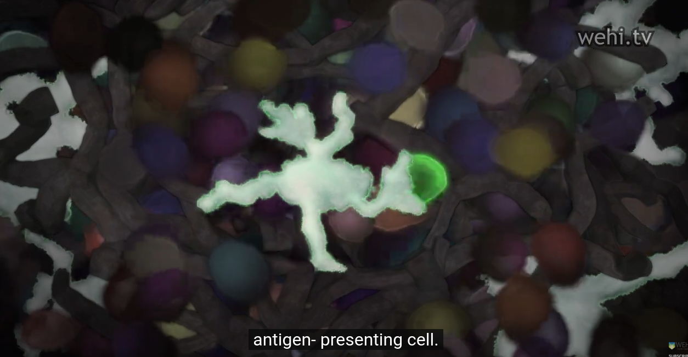
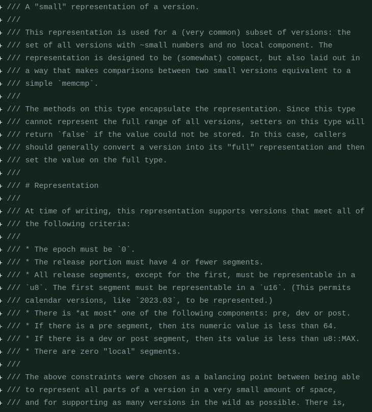
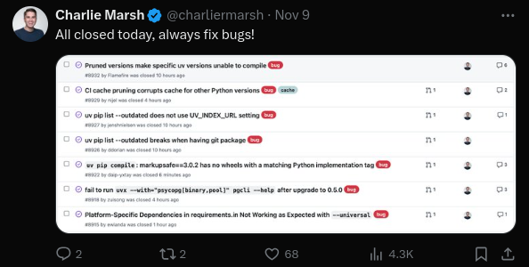
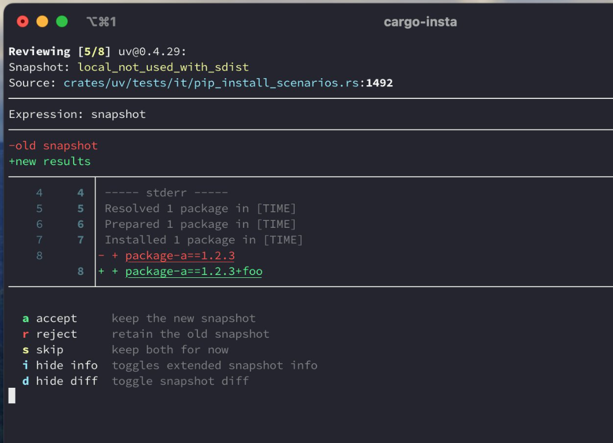

# Week plan
- Get familiar running indit on servers
- Bump prefect to 3.x
- Fix bug with docker and requests
- Meet with Data science and learn what metrics to include from the pipeline

# Monday

Add this to the docs for how to get the gemfury token?
PIP_EXTRA_INDEX_URL=https://1gyCDS-DEqfualmz9vyBThyWK2DXWCfQ10:@repo.oncoimmunity.com/pypi/

ssh aksel@cepi9

https://github.com/ohmyzsh/ohmyzsh/tree/master/plugins/direnv

## Run workwlof tests on cepi7
maked dev

Failed on docker auth, so I ran.
cloud auth configure-docker

make test worked without docker setup.

Worked! all tests pass on cepi7, I wonder why it differs?

## Prefect 3, what is new
https://docs-3.prefect.io/v3/get-started/whats-new-prefect-3 
1. Event driven pipelines. Can respond to external events like buket uploads, or can alter pipeline behavior depending on presence of events in the pipeline.
2. Transactional interface. We can roll back side effects on failures, like clean up files etc.


Q: How do people work on Indit on the servers? remote sessions with code locally? git on the servers?

Future reading: Alexandru intro to T-cells and the immune system, watch the video this afternoon?
https://neconcoimmunity.atlassian.net/wiki/spaces/NGS/pages/1366851733/NOI+knowledge+sharing

## Discussion tomorrow for server usage

- How do you get the files/packages you are working on onto the server?
- How do you edit files?
- Do you authenticate with git?
- How do you setup your shell environment on the server?
- Autenticate with docker?

From indit manual
- tmux for executing indit 
- prefect + port forwarding to view prefect status locally

## Stian 1 on 1 
NFS shared disk between the servers?
/id/aksell

# Tuesday

Can you get started on gathering metrics? 
- [x] Ask Marius: Is there a jira task for the metrics extraction? Who should I set up a meeting with to get started on the task?
If you schedule a meeting today maybe you'll have that tomorrow?
- [ ] Ask who to put Tiril in touch with?

- Try to run indit and find some problems?

- [ ] Schedule a 1 on 1 with Akira

This task could be a candidate? Make workflow testing less strics (i.e not fail due to,
checksums)
https://neconcoimmunity.atlassian.net/jira/software/c/projects/ID/issues/ID-275?jql=project%20%3D%20%22ID%22%20ORDER%20BY%20created%20DESC
Would get you more familiar with the workflow tests.

## prefect upgrade

unpinned pydantic
bumped prefect
Test new prefect version
- Run pipeline tests on cepi7, then open prefect dashboard, what do you see?
- Run pipeline with from cli, what do you see?

## Meeting - discuss how people use the servers
Releases - read in the manual.
People pull the latest tag when they do analysis.

Upgrade prefect to version 3.

Issues in the backlog to release.
We should do a release by the end of the year.
1.3.0

Alex:
- run indit, clone the repo, install and ran, output files stored on gcp.
- Push code on github, 
- no syncing between servers.
- remote session with vscode, push from server.
- Would like R pre installed and centralized storage

Per:
- Uses old hertzner server (doser)
- remote session with vscode
- no problem to switch between servers

Youness:
- works on ap models and uses indit
- vscode remote session

Marius:
- Works locally with some test data in R.
- Edits with vim in the terminal
- Copies files from the bucket when he runs on large data.
- Has to install R manually on each server.
- A lot of loading down and up to the bucket as an intermediary between the server.
- Just learnt that with tailscale you can ssh between servers so could save him an upload to gcs to move files between servers

Marius:

Hanna
- clone onto and off the servers
- mainly vscode with remote sessions

Possible improvements
- Utilities to work with buckets?
- Managed R installation on all servers
- Shared storage between servers, to make people more server agnostic
- ID cluster, could also manage things like R versions via slurm

To facilitate sharing:
- get a warning when you ssh about other people that are logged on and how much resources are in use, htop, who

We have 8 more servers from Nagasaki, for tropical disease projects.

We'll have 2 more colleagues in February++ starting from Heidelberg.
Eugene - starting next year. Systems biology and bioinformatics PhD.
Thiago - bioinformatics, structural biology, PhD. His heart is with sequence analysis.

## Extract score
We map value to files in constants.py already

What do we want to know?
- More accurate AP score per peptide or per amino acid in each peptide.
- Procesing what are the important scores to know?
- What are the most important binding scores
- Cleaner output that makes sense

Drop the garbadge.
744 GB of data for a project, but we don't know what we need.

Youannes also know what stuff contributes the most.

Learn what people actually use of the intermediate output.

You should not touch this output.
It is generated in indit with a command that looks at the pipeline output.
https://console.cloud.google.com/storage/browser/id-influenza/results/indit_v100_with_gisaid/influenza_a_high_risk_strains_results/ap_predictions/aggregated_predictions?pageState=(%22StorageObjectListTable%22:(%22f%22:%22%255B%255D%22))&inv=1&invt=AbiggQ&project=genuine-sector-223709
This goes to AP

AP_CLEAN_FILENAME_SUFFIX = "_all_predictions.csv" # Source data for heatmapt which are used to calculate hostpots

Hotspot epitope scorer is the last module in the pipeline.
Chop hotspots region into 9 and 10 mers
go back to predictions file, see which have the best coverage in the input sequences.
The goal is to pick vaccine elements.
Once we have a good hotspot with a nice AP score ish.
Then we look at the AP score for each 9 mer.
But then we want to also look at the binding score, so we can use that info.
Now we only have the immunogeniticy score which is the same as the AP score.
And we need to get close to th
Goal is a better per_hla.tsv file with not just immunogenicity score.
But also a binding and a proessing score. What model and what score is the most
important.
And group that info in a useful way.
Okay even better one file all_predictions.tsv that is nice, and maps to the pipeline steps
in a good way.
Probably 1 file 10-15 columns of numbers with hla 9-10mer pairs with good solid numbers.

Reduce output stored for intermediaary results.


Are there new models we should use?

Get a list from data science, what do they think is the most important scores?
- Peyman
- Youness
Lean how values are calculated:
- Ghazal, how are the values calculated, bias etc?

Doesn't make sense to curate values from old models that Data science does not want to use.
WE're at 1.6 and 2.4.
Probably it is version bumps of existing models, not completely new models.


Try running the pipeline for some input data
https://console.cloud.google.com/storage/browser/id-influenza/data/strains_of_interest/with_gisaid/ncbi_and_gisaid_influenza_a_fasta_most_frequent?pageState=(%22StorageObjectListTable%22:(%22f%22:%22%255B%255D%22))&inv=1&invt=AbiggQ&project=genuine-sector-223709
M1 is quite short fex. Or NS1 or NS2.
THen look at the output to get familiar with it.

100 of the most frequenct sequences, chop it to 5ish sequences.

## Peyman XAI for Antigen Presentation models
Set up a 1 on 1 with Peyman.
He will send you the AP score presentation.
Is it this one?
Resert has a high SHAP
XAI examples from AP models: https://neconcoimmunity.atlassian.net/wiki/pages/viewpageattachments.action?pageId=1559691270&preview=%2F1559691270%2F1559363617%2FXAI%20Examples.pptx
Antigen binding report: 
https://neconcoimmunity.atlassian.net/wiki/spaces/RD/pages/1827274758/Antigen+Binding+XAI+Report

Overview of XAI project: https://neconcoimmunity.atlassian.net/wiki/spaces/RD/pages/1569783821/XAI

Uses explainerdashboard
https://explainerdashboard.readthedocs.io/en/latest/

Can be used inline in a jupyter notebook.

https://github.com/OncoImmunity/explanation-notebooks
Notebooks that explain various models.
Seems useful, seems like where he's working from. I tink you can run these if you want to.

## Model versioning.


## later
Anki cards from Ioannis talk.

Release process formality. Work structure vs orc style.
Inwards looking? What is used out there? Where are the papers
that are coming out that are shaking the company at the core?
I feel progress in modeling the phenomena weære modeling is changing
very quickly. How can we rest with old models?
Acting as if we're a profitable established business.
Where is the urgency?

GS util cp to and from bucket.

GCP preview csv.

Useful to click on people in Confluence you can then see where they're
working now.

## Talk with Akira
I like that you took the time to meet with me so quickly!

0. Where do you live in Japan?
1. What is the key metric for NEC to be willing to invest in NEC Bio?
2. What are the key metric for driving business with pharma companies?
3. How can I help with driving bussiness? I have a conference coming up where

I could meet research groups, possibly pharma companies. But I am not sure
what leads to target or how. WHat do you think would be most valuable?

4. How will ID make money?

5. AI progress. What are your timelines like and how does it affect strategic planning
for the business.

6. What behavior/attitude/cultureal shift would you create in NOI if you could
snap your finger and have one thing change over night in NOI?
Urgency? Strong investment/ownership? Employee mindset.

Moto Nishihara - CTO in NEC.
AI systemts for IT expertise in NEC. How can it be used here? 
7. Who and where are the best people in large AI models in NEC?

8. Who are the competitors you watch the most closely?

subsea to satelites

**Looking outwards, not inwards** Means we need to look not to the DA 
team for updated models. We need to think about the ID problem. Find the
best models. Run those. Grab the problem by the balls and do our best
to find the best solution. Using NLA or NOI model is not the right goal
solving the problem the most effectively is.


## Aga wrote all of indit
50 commits but <500 lines from Hanna.
https://github.com/OncoImmunity/indit/graphs/contributors
Marius has also only written a bit of it.


# Wednesday
Update the indit docs to mention gemfury tokens?
That you can get them from servers?
- set up 1 on 1 with Moritz

Re-imburse cursor?
Use a thing to automate receipts.

**How to fill out time sheet**
Put your name in the top corners and the signature.
7,5 each day. 30% on indit. rest on influence. Holiday is PH, sick is S.


I want to get ready for the 1 on 1 with Ghazal. 
By running indit with input and exploring the output.
Checking how model versions are set in DS models.


Idea: Use direnv for pip index and prefect config env var?

## INdit manual
You run slow tests before you merge. I didn't so lets do that.
**pull main on server and run slow tests**
I can't pull on the server with github https auth.
This says I need a separte key for github and server ssh.
I should remove the ssh key I have not from github then and create a new for 
github.
https://neconcoimmunity.atlassian.net/wiki/spaces/OP/pages/675718918/How+to+configure+SSH+for+Hetzner+servers+and+Github

After you have the separate github and ssh key you can run a script?
https://neconcoimmunity.atlassian.net/wiki/spaces/OP/pages/675718918/How+to+configure+SSH+for+Hetzner+servers+and+Github


**Re-install cursor to be runnable as program**: Followed this.
https://forum.cursor.com/t/tutorial-install-cursor-permanently-when-appimage-install-didnt-work-on-linux/7712
To get the icon running I had to do:
```shell
sudo sysctl -w kernel.apparmor_restrict_unprivileged_userns=0
```
And set up an alias in .zshrc
```shell
alias cursor='~/Applications/cursor/cursor.AppImage'
```
Also has an update script and instructions for how to add an upgrade service. I did not set up that.
How can you update cursor otherwise?


## Indit release guide

# Thursday

[Cursor demo docs](cursor-demo.md)

## SSH key setup for github
I create a new key for github. And added this to the ssh agent on my local machine with ssh-add.
I also set the config to use this key for requests to github but it seems to work without this too
so maybe that is only to try this key first for requests to github.
```
Host github.com
  HostName github.com
  User git
  IdentityFile ~/.ssh/github_ed25519
```
I needed to add this line to set ForwardAgent to true. This forwards requests to the ssh agent
back to my local machine. Do I need this for all the machines?
```
Host cepi9
  HostName cepi9
  User aksel
  IdentityFile ~/.ssh/hetzner_ed25519
  ForwardAgent yes
```

After this I can pull and push via ssh to github. Really nice.
If you pulled with https you need to reset the origin url to the ssh path git@github.com:org/repo.git

## Ghazal 1 on 1
Test out tablets. Remarkable or sunlight computer.

Processing 200k
Bind ?
Presentation ~1million

Statistics background.

Absotlue window is important patent wise.
The absolute window is between the positives and negatives

Combined16 is 16 diferent dataset

- [ ] Read the patent for processing
https://neconcoimmunity.atlassian.net/wiki/spaces/RD/pages/1134755865/Processing+Models
- [ ] Watch video

- [x] Anki relative and absolute window

PTP- processing training prepare

Final model v2.0 is the latest processing release.
https://neconcoimmunity.atlassian.net/wiki/spaces/RD/pages/1249968165/Final+model+v2.0+-+Expressionless
Shap values for 

https://neconcoimmunity.atlassian.net/wiki/spaces/RD/pages/1249968165/Final+model+v2.0+-+Expressionless#Training-feature-importance
SHAP values for cancer test set.

Antigen model builder has everything you need.
We could look at shap values for each training run.
Or we could do curation of the values based on training time importance.

Is indit event trained separtely?
Check with Marius.
Use shap values for expressionless.


Docker images are tagged.
The columns shouldn't have change in version 2?
Antigen model builder is the repo they use for training models: 
https://github.com/OncoImmunity/antigen-model-builder/releases


## Erlend
Nextflow has a google batch, kubernetes and slurm runtime.
Google kubernetes engine is a managed kubernetes something?

https://pypi.org/project/uv/
UV in replacement for pip that is much faster. It also does python version mgmt. Written in rust.

https://www.hausmania.org/ Torvald is at Chimera?

## Example commit messages from Trym
Details about why it is changing, and how the new version looks.
making a change to the CI names.
https://github.com/OncoImmunity/hla_typing/pull/73/commits/704c6928bed5e2f13622f8ccff178e8666094db3

https://github.com/OncoImmunity/noi-nle-collaboration-gcp-project/commit/69ccfccd8e70473bc67a87f35be17f28d678df5c

Breaks down the commit in:
MOtivation: 
Why

Changes:
What

Relevant links:
This is the docs for this stuff.

Terraform project set up for a collaboration with NLA where they store
the container images. 
https://github.com/OncoImmunity/noi-nle-collaboration-gcp-project

Stian has written an R package for visualizing chimeric RNA, it was his masters thesis
https://github.com/stianlagstad/chimeraviz?tab=readme-ov-file

Example detailed review by Trym. Unit tests. Wanting log messages before and after. Wanting
unit tests. I can write code like this fairly easily with cursor I think. And maybe write
the commit messages too?
https://github.com/OncoImmunity/splice-handling/pull/140
Show me why it is better before and after in the commit message.
```
Note; there are two different output jsons that needs to be asserted;
the "final" json and the "full" json

Also added unit tests to test the assertion functions.

The previous error message looked like this:
\`\`\`
{
  key: value
  ... <deliberately truncated to just show the pattern>
  <400 lines more>
}
\`\`\`

Now it looks like this:
\`\`\`
Inconsistencies detected, line 400 differs.*
Original text:
`key: value`
New text:
`key: value2`
\`\`\`
```

## Remarkable
Pro has colors but is 7k
https://remarkable.com/store/remarkable-2 700 off this week.
Daylight computer is 700 dollars 
https://daylightcomputer.com/

## WHat to work on
I don't think upgrading prefect to prefect 3 is urgent.
I would focus on your benchmark task first. Then you have time to get
familiar with prefect by using it and getting in to the code.
When you are more familiar it is easier to validate that things work well.

I am wondering if I am writing up the intros I get in the best way?

I would maybe like to keep one document per business area in confluence
which captures my best understnading of each product.
One for PCV.
One for AP prediction.
One for BCE?
Hmm AP, PCV and PI overlap. I wonder what that means.

I will try to write one for BCE wiht my notes from Ionannis's talk.
I think writing down notes from my intro with Borris would also be useful.
Maybe you can whack that in a doc. Polish it up a bit and create 3 or 4 anki docs.
THese intro talks feel very valuable for grasping how things work, so I don't
want them to be lost in my markdown notes.

Okay I will make a tea now.
Make 4 anki cards from my talk with Ghazal.
Then write up the BCE doc from Ioannis.

Chart/cheat sheet for how to pick an estimator
https://scikit-learn.org/stable/machine_learning_map.html

## Reading the indit manual
Before merge run:
make test
make slow-test
make workflo-test
./tests/integration_test.sh

That is a lot of stuff to check.
Integration test pulls docker images.
It just runs the pipeline with the test data.
```shell
indit -i test_data/pipeline/ --force
```

Prat of the pipeline runs 100% on all 64 cores.

https://www.dwarkeshpatel.com/p/chinas-economy
Dwarkesh makes plots with claude.

I want zsh, oh-my-zsh, fzf, zsh-autocomplete on the indit servers.

- [ ] Add taks to add CI that runs test and slow test?

config/default_settings.yaml defines parameters for steps and which
are enabled and where output is written.
Neat solution!

peptide scorer links the covid mutant repo is that right?
Dont understand what peptide scroe aggregator does
Can we generate docs from the code? Re describing params seems redundant

What is the hla population simulator?
anki the mdoules tomorrow, useful to know ish what they are

one repo per module? I need to find these repoes is it really the case for all of them?
The junction scorer is yet to be included in the main indit pipeline, but has been included in this repository to be able to run it.
In the future it might be moved to its own repository and used as a Docker image, as we do in most of the existing steps in the indit pipeline.

# Friday
https://biologynotesonline.com/mhc-antigen-processing-presentation/
These notes look good. You can go here to search for things you want to learn I would say.
They have many pages on immunology
https://biologynotesonline.com/category/microbiology/immunology/
I think this can be my new bored on the phone activity. Open biologynotesonline and read about a topic.

The models and work feels 5-7 years old. You can't stay that far behind in computational biology?
How can we up the speed of innovation here?
We can't be looking inward, guarding patents, guarding secrets. Other people are bound to have
more original and better thoughts than us. We must execute well and beat the competetion that way
but be open and look out so we can learn and innovate.
Kill our darlings. Kill the models and repos we have now regularily so we keep seeking and improving.
Tension between everyone has agency and does everything vs specialization into roles and hand off, with boundaries
"oh no I don't do that I'm a software eng". In practice this might not be a problem, I can just try to act with agency
and get what I believe should be done, done.

Could we have lots more training data for the expression free models because we don't need expression levels?
```shell
Training datasets:
oMass spectometry experimental data with RNA-seq
oPublic – Pearson et al. 2016 https://www.jci.org/articles/view/88590 
oProprietary – CaymanChem (Prop1, Prop2, Prop2.5, Prop3, Prop10)
Repo: https://github.com/OncoImmunity/antigen-model-builder
```


https://biologynotesonline.com/tumor-immunology/
Very relevant to what we work on.

**uv pip is "the way" from now on**
So you can upgrade away from pyenv and try it locally. Then ask on the team
meeting next week if people are okay with moving indit over to it?
You can open a PR so people can test it out.

It would redo the dependency mgmt quite fully I think. But maybe that could be a good thing?
https://astral.sh/blog/uv-unified-python-packaging

Has support for workspace dependencies. I.e compbining multiple packages in one git repo.
I think this could be really good for indit. We could move more of the packages to the
main indit repo.

Fuck I love reading and learning, this has been a great work week.

## Suggestion to move to using UV and centralizing our codebase
1. We have one CI setup. No need to update and maintain multiple
2. More visibility of what others are working on
3. Easier to make cross cutting changes that both update a module and it's users
4. Less overhead. Why separate out a package before we have 2 or more users?
5. Easier dependency mgmt, we can use uv and have one shared lockfile.
6. Easier to find the implementation and understand the pipeline as a whole
7. How likely is it that we'll have multiple users of our packages?
8. We can still publish docker images for packages in the pipeline if others want to use them.

I could start by moving covid mutatnt into indit as a first experiment?

https://github.com/OncoImmunity/indit/pull/206
**Marius prefers logger.error and sys.exit for critical errors**
 With a descriptive error message
instead of just a dumped stacktrace.

No filenames in the code. Put them in constants.py
We use dask for parallelizing over n-workers (threads).

Trym opens a PR with just an interface to ask for feedback on the interface needed for a commit. I like it.
https://github.com/OncoImmunity/indit/pull/201/files

PR for dockerizing the vaccine element set selector. Useful as a way to build docker images with github CI for indit.
https://github.com/OncoImmunity/indit/pull/205/files
Part of this PR
https://neconcoimmunity.atlassian.net/jira/software/c/projects/ID/issues/ID-282?jql=project%20%3D%20%22ID%22%20ORDER%20BY%20created%20DESC

**attempt at fixing cursor issue for good**
https://askubuntu.com/questions/1511854/how-to-permanently-disable-ubuntus-new-apparmor-user-namespace-creation-restric
To avoid runing this on every reboot 
```shell
sudo sysctl -w kernel.apparmor_restrict_unprivileged_userns=0
```
I ran:
echo 'kernel.apparmor_restrict_unprivileged_userns = 0' | 
  sudo tee /etc/sysctl.d/20-apparmor-donotrestrict.conf

## Setting up NNN
Setup plugins following this, created .config/nnn/plugins
https://www.youtube.com/watch?v=-knZwdd1ScU&t=305s

Added env vars to .zshrc to enablpe preview plugin.
Installed xterm, bat and tree for preview with highlihting.

Changed the nnn pager to use bat by editing the tui-preview file.

  "NNN_PAGER=bat --paging=always --style=numbers --theme=ansi"

**setting up autojump**
sudo apt install autojump
Activation instructions
cat /usr/share/doc/autojump/README.Debian
Updated .zshrc with activation
Now you can use j to autojump!

I have sudo access on the servers.
I am tempted to install zsh, oh my zsh, fzf and nnn on my remotes too with a script.
That could be neat. I could have a bare repo for my dotfiles in NOI.

This is turning into sophisticated procrastination I think you've reached diminishing returns now.
I think it is a desire to have cool tools and be seen as savy more than an actual need?

**class2-scorer** uses direnv!
So yes you can and should set up direnv in indit. Cookiecutter seems to be updated with it.


We do have a lot of fucking ram sitting there.
Like ~20TB


## Run indit on server
ssh connection with cursor has all my extensions!
Amazing. It makes a lot more sense to try and get the file viewing and editing experience
I want inside cursor than in the terminal then, because it is super portable between servers.
I could install the file utils on the server easily then it worked.
I'll try just installing all my extensions to have the full experience.
And I have the cursor cli generation! It does not get better than this.

- View csv files
- Nice file explorer for results
- How do you jump back and forth between file explorer and files?
- How do you jump back and forth between chat window and code window?
- Jump to terminal and back?
- Get terminal working well
  - fzf still needs to be set up outside cursor. So maybe you could have a script and bare dotfile for that?

The setup script also needs to set my git credentials.
I can create a private repo for this now on my account.

Maybe try uninstalling vscode and see if you can write git commit messages okay then?

## Foam is so back!
I tink links to project I work on repeatedly or even sub sectoin
in the same project could be really good for getting more
organized in my notes. Then I can link back to one place
where everything about a project is, while keeping
the update trail of my daily log of works by linking to the
project doc, updating that, even linkind to a section
in it and hten coming back.

Worked more on the demo today
[[2411-cursor-demo]]

![[2411-cursor-demo#Composer]]

Create a new project document by just writing out the link!
[[new-document]]

Car T cell video
https://www.youtube.com/watch?v=CxxuqIDyF_I
CARs seem to not bind to MHC? So they need
other surface modifications outside the
MHC pathways to be present?

## Cytotoxi T cells videos
https://www.youtube.com/watch?v=rDEduT62Awc
- empty toxic particles inside the cell
- dendritic cells need to find a naive T cell with the right naive T cell in a lymph node that has 
a matching T cell receptor.
- MHC clusters before T cell activation
- MHC has a long signaling arm inside the cell



## Charlie Marsh of astral is super inspiring
I like how Charlie Marsh writes code and git messages.
https://github.com/astral-sh/uv/issues/9479
Not review on everything.
Comments. Resolves one issue in each PR.
An issue is:
given
this and that
You get
...
We should explain that you've got a conflicting source.


https://github.com/astral-sh/uv/pull/789/files#diff-b51edade879ca8a5595d130fb5be0895786470639e6eedeae2364091e3b17b63R739
Burntsushi write a long comment explaining why a thing is done the way it is done.
And what the idea and thinking behind it was.
Read version.rs




Snapshot testing? seems really nice to review
https://x.com/charliermarsh/status/1853624730160664998/photo/2


Pytest snapshop testing?
What would be our equivalent?
Snapshot the input and output of pipeline module?

Daylight savings gives me more daylight to farm my code.
I love it. He is embrasing some version of grinding. At a blazing speed.
Trym would be onboard I think.

I want to try autofix.
Could Ruff save us time in review?

 - [ ] Set up cliboard history. Copyq