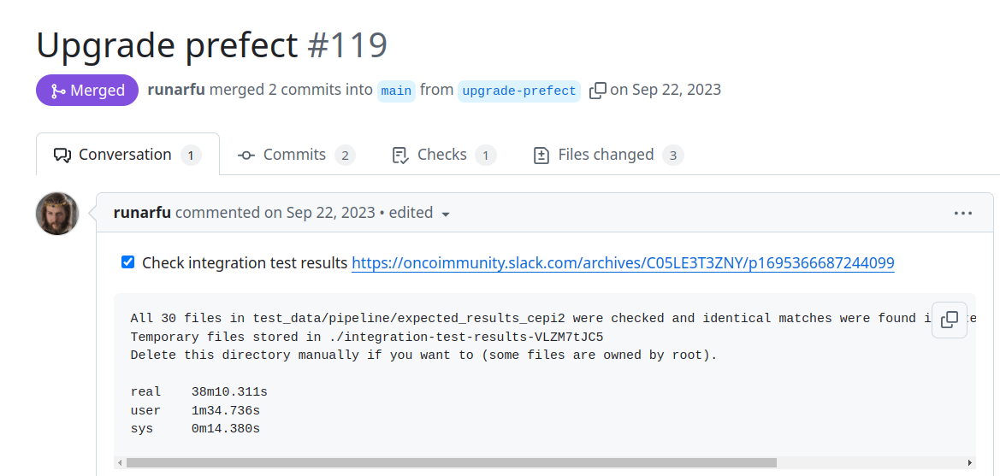
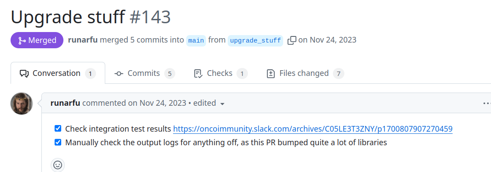

# Week 3
I will hold a demo for cursor.
Wednesday I will prepare for that for 2-4 hours and I have 3 hours of meetings too.

Monday I want to finish up the benchmark for UV and have a PR ready that we can peek at in the
team meeting on Tuesday.
I also want to get a grasp on the columns and data output from indit so I can start

I forsee some more onboarding tasks this week, I know I'll have QMS with Pinalee, and likely some HR onboarding now that
Gunn is back.

I feel motivated to get a great quick dev setup where we ship code on the hour here with high confidence.
And after the talks and twitter feed from the astral founder I see a path. Quick CI for all we care about.
Code in one place so we can integrate accross and test accross package boundaries. Snapshot tests for module
inputs and outputs that we review diffs in for PRs.

links:
* [[2412-indit-intermediary-metrics]] https://neconcoimmunity.atlassian.net/jira/software/c/projects/ID/issues/ID-294?jql=project%20%3D%20%22ID%22%20ORDER%20BY%20created%20DESC
    * bucket with example output from indit - influenza https://console.cloud.google.com/storage/browser/id-influenza/data/strains_of_interest/with_gisaid/ncbi_and_gisaid_influenza_a_fasta_most_frequent;tab=objects?pageState=(%22StorageObjectListTable%22:(%22f%22:%22%255B%255D%22))&inv=1&invt=Abix9A&project=genuine-sector-223709&prefix=&forceOnObjectsSortingFiltering=false
* [[cursor-demo]] confluence https://neconcoimmunity.atlassian.net/wiki/spaces/OP/pages/1870004225/Cursor+AI+code+editor

# Monday

I will try a simple implementation of UV. Get the lockfiles ready. Or even keep the current locking
format?
And try running the commands we'll need.
In the meeting see if you can find 1 windows and mac user that would volunteer to see if the PR works for
them and if installing uv is easy.

[[2412-indit-intermediary-metrics]]
Working on this. If I want to upgrade to v2 models or not feels like a big deal.
If I do want to upgrade before I build the metrics I don't need to meet with Peyman now.
Could I maybe meet with Aga to discuss what upgrading to v2 would mean in terms of validation?

I think I have my task for Today set up.
- [ ] Understand what a upgrade to V2 for the AP models would mean, meet with aga to discuss
I would do this in the morning, so I can meet with Aga before the day is over. And have input to
bring up in the meeting tomorrow.
- [ ] Finish benchmarking UV and open a draft PR that I can show in the meeting tomorrow.
- [ ] (Stretch) familiarize yourself with the model output from your influenza run

## Upgrading to v2 models
Could it be useful to talk to the person who did the upgrade in the PCV team?
Who did the upgrade and validation?

Change log. 2.4.1 was released in October 2023. Looking back in the releases
it seem the only real release before that was 1.6 which we are on. The in between
releases don't have a big change log type thing.
https://github.com/OncoImmunity/antigen-model-builder/releases

- [x] msg Aga to get input

Marius is away 10.12-2.01. So if you need his input it is this week or next.

- Book cepi9. ✅
- Bump ap models
- Run workflow tests


Had a meeting with Aga in [[2412-indit-intermediary-metrics#v2 AP models (paused ❌)]]
For validating the output post model upgrade I think the workflow tests could be nice candidates for snapshot tests.
Assert that the output looks a certain way.
And then we could snapshot the hotspots, hotspot clusters etc down the line to get confidence that
the update behaves well.

### Bumping AP model
Prompt:
This is a pipeline called indit for finding vaccine element candidates given a set of pathogen protein
sequences. Indit runs as a prefect pipeline where multiple steps are build as separate packages 
distributed via docker. Now we want to upgrade the images used to run the core AP models.
To do that we have to find where the AP model image versions are set, bump them.
Run tests for that package with the new AP models.
Then bump the version of the peptide-score image (think the image/repo is actually called covid_mutant) that calls the AP models with the input from indit.

I think you need to bump the model in covid_mutant
THen find a way to run indit with an updated covid_mutatn. Can I build a docker image locally?
And then run with that without pushing it?

In covid_mutant I see omni runnrs that map to version numbers that match the AMB versoin numbers
https://github.com/OncoImmunity/covid_mutant/blob/66f615a1ceeaf515fc563972f9aa04327acf8f2f/covid_mutant/run_omni.py#L244
The last one is for 1.6
Commit to add support for 1.6 https://github.com/OncoImmunity/covid_mutant/commit/869d61e2623ec615e18b89f646ae5c1c645a337b
Actually has something like a snapshot test. Defines the output we expect and then runs omni
with a slow test, that asserts the output looks as expected.
I like that. I could do something similar.
A class to run omni(what does the name mean?), and a test that asserts we produce an expected output.
I could create a new test that asserts the output looks like before. That then fails. And we
can discuss what we want the output to look like.

Q: IS the AMB version used in indit defined in indit via AMB_IMAGE or is it defined in 
covid_mutant? 

Q: What is a good way to run indit with a local version of covid_mutant? 
Build and tag the image locally. Then update the image tag in indit constants.py

There is also a separate image name directly to AMB 

What is a good way to run indit with a different image version?


## uv for indit
- [x] Read up on uv.lock vs requirements.txt https://github.com/astral-sh/uv/issues/6271
- [x] Create uv lock file
    - [ ] Compare locked dependencies to requirements lock files
- [ ] Time uv install and uv cold install and uv add

This is exactly what I need to enable moving to uv.lock without updating all our deps
https://github.com/astral-sh/uv/issues/6275#issuecomment-2343641976
```
Add all the constraints to tool.uv.constraint-dependencies.
Run uv lock.
Remove the constraints from tool.uv.constraint-dependencies.
```

Don't use dev-dependencies
https://docs.astral.sh/uv/reference/settings/#dev-dependencies
They want you to use dependency-groups.dev instead


I think it makes sense to write a new lockfile with uv without trying to use the exact
versions pinned in the requirements files. UV wants to update the lockfile quite often
as part of uv run etc. I don't think I'll be able to force it to a lockfile state based
on our requirements files.
**uv workspaces**
Workspaces. We can move packages to the indit dir and keep them
all with one lockfile. They can have separate dependencies. But can't have
conflicting versions of dependencies.
They also enforces a single requires python value accross the workspace.
So bumping and upgrdaing python and packages would by default mean all
packages in indit are upgraded.
Alternatively you can move all the code in one repo but have them
be path dependencies. I.e separate python/uv projects with their own locking
that you install in the indit project. I still think you won't be able to run
separate python versions? or have conflicting dependencies accross your packages.
But you could have some packages without uv for example.
https://docs.astral.sh/uv/concepts/projects/workspaces/#when-not-to-use-workspaces

**uv way to install deps separte from project in docker images**
Install deps in one layer, and the project itself later. So the deps can
be cached if they don't change.
The gist is that you can copy in uv.lock, then run uv sync --frozen --no-locals (nope, seems outdated,
https://github.com/astral-sh/uv/pull/6398, check the docs)
UV release log is a useful way to track updates to the uv api https://github.com/astral-sh/uv/releases
and find the github issues linked to adding or discussing how to do a thing.

**uv versioning**
https://docs.astral.sh/uv/reference/versioning/
API not stable yet. Is there a way to specify what version of uv to use?
So we can make sure our packages work when people install uv?
This is a downside of using uv now. uv pip seems like it would be more
robust. Maybe we could do uv pip first. Then an only uv flow after
they have a stable release?
That said, uv is as of 3 weeks ago classified as Production/stable on pypi. Same
as ruff.
https://github.com/astral-sh/uv/pull/8943

**uv can load env vars**
https://docs.astral.sh/uv/configuration/files/#env
But only with an option or by setting an env var to point to the env file.
Seems nicer than a .envrc file to me though?
Or maybe not. If direnv is used in other places I think it is easier to stick with that.

PCV team wants to set up precommit hooks https://neconcoimmunity.atlassian.net/browse/WGS-141

## Prefect bump 🧊
I think you can open a draft PR with your prefect bump. It will just be lost if you
keep it locally. There is no later and fast is fun.

You don't need to know exactly how to validate to open a PR. You can describe what you
did, ask if they'd test anything else, and ask them to review the code. You can't know
everything ahead, the feedback is how you get to a good solution.

Draft PR with tests for prefect task level caching from Runar.
https://github.com/OncoImmunity/indit/pull/172/files
Maybe you can find something useful when you want to test prefect 3?

Open discussion on how to do logging in indit
https://github.com/OncoImmunity/indit/pull/129

People could have to upgrade their prefet database locally?
https://docs-3.prefect.io/v3/resources/upgrade-to-prefect-3
> prefect server database upgrade
> When migrating from Prefect 2.0 to Prefect 3, be aware that flows may now complete successfully even if they contain failed tasks, unless you explicitly handle task failures.

I don't want to do this now. It requires reading our prefect code.
Maybe upgrading everyone's prefect db if they have state in there that they like.
And error handling for failed flows has changed.
This is stuff I would want to test before merging. Like do we handle failures well when
data is broken fex.

## Plan pair programming?
I could ask in the meeting tomorrow?
Anyone that have a task they want to pair program on this week?

int-int means intelligen-integration it is a 


Runar runs integration tests and links to run output when bumping prefect.
https://github.com/OncoImmunity/indit/pull/119

He also runs integration tests when bumping all deps
https://github.com/OncoImmunity/indit/pull/156

But then for bumping lots of deps he manually checks the logs
https://github.com/OncoImmunity/indit/pull/143



For later this PR is important, runar rewrote indit to call
AMB and neunethlabind directly instead of via covid_mutant
https://github.com/OncoImmunity/indit/pull/10/files

# Tuesday

We need to update our team acronym, it used
to be GLOHAM, I think it is a combination of
team members first of last names if there
are collisoins we use the last name letter.
We use this to decide who prepares the next 
meeting agenda.

The team members and the current acronym is:
G: Marius Gheorge
L: Aksel Lenes
O: Alexandru Oidainic
H: Hanna Søderstrøm
A: Agnieska Gromadka
M: Matheus Ferraz
Now Matheus is not joining so we need a new acronym


These two join our meetings bu
Per Brattås
Youness Asimsade

L: Aksel Lenes
O: Alexandru Odainic
G: Marius Gheorghe
H: Hanna 
A: Agnieszka 


UV bench marking is fine. So is prefect bumping. But I think progress on your
core software development task is more imporatant. You want to fix the
things that affect the real life use cases of people. uv or prefect are not that.
You can finish the benchmark, and push a draft PR for discussion meeting, but
then focus on the core task of curating the output.

## Benchmarking uv

### Current Setup (pip-tools) Benchmarks

```bash
# 1. Fresh install (production)
git clean -fxd
time make

# 2. Fresh dev install
git clean -fxd
time make dev

# 3. Add pandas dependency
time make update-requirements
```

Results:
| Scenario | pip-tools time |
|----------|---------------|
| Fresh `make` | 1m 23s (35.87s user, 2.59s system, 46% cpu) |
| Fresh `make dev` | 1m 13s (32.79s user, 2.24s system, 47% cpu) |
| Add pandas | 1m 32s (22.71s user, 1.77s system, 26% cpu) |

[Next: We'll implement uv changes and run the same benchmarks plus the cold start (no Python) scenario]

### UV cenchmark

#### Setting up UV
```shell
grep -oP '^[a-zA-Z0-9\-_]+==[0-9\.]+(?!\.)\b' requirements.txt | awk '{print "\""$0"\","}' > reqs.txt
# copied the deps into pyproject.toml

[tool.uv]
# Ensure that the grpcio version is always less than 1.65, if it's requested by a
# transitive dependency.
constraint-dependencies = [
    "aiosqlite==0.20.0",
```

```shell
uv lock --extra-index-url=https://1gyCDS-DEqfualmz9vyBThyWK2DXWCfQ10:@repo.oncoimmunity.com/pypi/
```
Fails with this
```
➜  indit git:(uv-for-deps) ✗ uv lock --extra-index-url=https://1gyCDS-DEqfualmz9vyBThyWK2DXWCfQ10:@repo.oncoimmunity.com/pypi/                 
  × No solution found when resolving dependencies for split (python_full_version == '3.12.*' and platform_system == 'Windows'):
  ╰─▶ Because prefect==2.20.14 depends on pendulum{python_full_version >= '3.12'}>=3.0.0 and pendulum{python_full_version >= '3.12'}==2.1.2, we
      can conclude that prefect==2.20.14 cannot be used.
      And because your project depends on prefect==2.20.14 and your project requires indit[dev], we can conclude that your projects's
      requirements are unsatisfiable.
```

Inspecting my installed pendulum version I see 3.0.0
I removed the pin on pendulum, so we uv can determine the right version.

```shell
  × No solution found when resolving dependencies for split ((python_full_version == '3.12.*' and platform_machine == 'AMD64' and platform_system
  │ == 'Windows' and sys_platform == 'win32') or (python_full_version == '3.12.*' and platform_machine == 'WIN32' and platform_system ==
  │ 'Windows' and sys_platform == 'win32') or (python_full_version == '3.12.*' and platform_machine == 'aarch64' and platform_system ==
  │ 'Windows' and sys_platform == 'win32') or (python_full_version == '3.12.*' and platform_machine == 'amd64' and platform_system == 'Windows'
  │ and sys_platform == 'win32') or (python_full_version == '3.12.*' and platform_machine == 'ppc64le' and platform_system == 'Windows'
  │ and sys_platform == 'win32') or (python_full_version == '3.12.*' and platform_machine == 'win32' and platform_system == 'Windows' and
  │ sys_platform == 'win32') or (python_full_version == '3.12.*' and platform_machine == 'x86_64' and platform_system == 'Windows' and
  │ sys_platform == 'win32')):
  ╰─▶ Because pandas==2.2.3 depends on numpy{python_full_version >= '3.12'}>=1.26.0 and numpy{python_full_version >= '3.12'}==1.25.1, we can
      conclude that pandas==2.2.3 cannot be used.
      And because oiml==4.7.1 depends on pandas==2.2.3, we can conclude that oiml==4.7.1 cannot be used.
      And because your project depends on oiml==4.7.1 and your project requires indit[dev], we can conclude that your projects's requirements
      are unsatisfiable.
```

Bumping numpy to 1.26.4 latest 1.x release before numpy 2.0

Now the deps could be resolved.
these are the constraints I ran with
```python
[tool.uv]
constraint-dependencies = [
    "aiosqlite==0.20.0",
    "alembic==1.13.2",
    "anyio==4.6.0",
    "apprise==1.8.0",
    "asgi-lifespan==2.1.0",
    "async-timeout==4.0.3",
    "asyncpg==0.29.0",
    "attrs==23.2.0",
    "cachetools==5.4.0",
    "certifi==2024.7.4",
    "cffi==1.16.0",
    "charset-normalizer==3.3.2",
    "click==8.1.3",
    "cloudpickle==3.0.0",
    "colorama==0.4.6",
    "contourpy==1.3.1",
    "coolname==2.2.0",
    "croniter==2.0.7",
    "cryptography==43.0.1",
    "cycler==0.12.1",
    "dataclasses==0.6",
    "dateparser==1.2.0",
    "distributed==2024.10.0",
    "dnspython==2.6.1",
    "docker==7.1.0",
    "email-validator==2.2.0",
    "exceptiongroup==1.2.2",
    "fastaparser==1.1.1",
    "fonttools==4.55.0",
    "fsspec==2024.6.1",
    "google-api-core==2.23.0",
    "google-auth==2.32.0",
    "google-cloud-core==2.4.1",
    "google-cloud-storage==2.18.2",
    "google-crc32c==1.6.0",
    "google-resumable-media==2.7.2",
    "googleapis-common-protos==1.66.0",
    "graphviz==0.20.3",
    "greenlet==3.0.3",
    "griffe==1.5.1",
    "h11==0.14.0",
    "h2==4.1.0",
    "h5py==3.12.1",
    "hpack==4.0.0",
    "httpcore==1.0.5",
    "humanize==4.10.0",
    "hyperframe==6.0.1",
    "idna==3.7",
    "importlib-metadata==8.5.0",
    "importlib-resources==6.1.3",
    "itsdangerous==2.2.0",
    "jinja2==3.1.4",
    "jinja2-humanize-extension==0.4.0",
    "joblib==1.4.2",
    "jsonpatch==1.33",
    "jsonpointer==3.0.0",
    "jsonschema==4.23.0",
    "jsonschema-specifications==2023.12.1",
    "kiwisolver==1.4.7",
    "kubernetes==29.0.0",
    "locket==1.0.0",
    "mako==1.3.5",
    "markdown==3.6",
    "markdown-it-py==3.0.0",
    "markupsafe==2.1.5",
    "matplotlib==3.9.2",
    "mdurl==0.1.2",
    "msgpack==1.1.0",
    "oauthlib==3.2.2",
    "oiml==4.7.1",
    "orjson==3.10.6",
    "packaging==24.1",
    "pandas==2.2.3",
    "partd==1.4.2",
    "pathspec==0.12.1",
    "pillow==11.0.0",
    "polars==1.2.1",
    "prefect==2.20.14",
    "proto-plus==1.25.0",
    "protobuf==5.28.3",
    "psutil==6.1.0",
    "pyarrow==17.0.0",
    "pyasn1==0.6.0",
    "pyasn1-modules==0.4.0",
    "pycparser==2.22",
    "pydantic-core==2.20.1",
    "pygments==2.18.0",
    "pyparsing==3.2.0",
    "python-dateutil==2.9.0",
    "python-multipart==0.0.9",
    "python-slugify==8.0.4",
    "pytz==2024.1",
    "pytzdata==2020.1",
    "pyyaml==6.0.1",
    "readchar==4.1.0",
    "referencing==0.35.1",
    "regex==2024.5.15",
    "requests==2.32.2",
    "requests-oauthlib==2.0.0",
    "rfc3339-validator==0.1.4",
    "rich==13.7.1",
    "rpds-py==0.19.1",
    "rsa==4.9",
    "ruamel-yaml==0.18.6",
    "ruamel-yaml-clib==0.2.8",
    "scikit-learn==1.5.2",
    "scipy==1.14.1",
    "seaborn==0.13.2",
    "shellingham==1.5.4",
    "six==1.16.0",
    "slack-sdk==3.31.0",
    "sniffio==1.3.1",
    "sortedcontainers==2.4.0",
    "tabulate==0.9.0",
    "tblib==3.0.0",
    "text-unidecode==1.3",
    "threadpoolctl==3.5.0",
    "toml==0.10.2",
    "toolz==1.0.0",
    "tornado==6.4.1",
    "typer==0.12.3",
    "typing-extensions==4.12.2",
    "tzdata==2024.2",
    "tzlocal==5.2",
    "ujson==5.10.0",
    "urllib3==1.26.19",
    "uvicorn==0.28.1",
    "websocket-client==1.8.0",
    "websockets==12.0",
    "xxhash==3.5.0",
    "zict==3.0.0",
    "zipp==3.20.2",
    "aiosqlite==0.20.0",
    "alembic==1.13.2",
    "anyio==4.6.0",
    "apprise==1.8.0",
    "asgi-lifespan==2.1.0",
    "async-timeout==4.0.3",
    "asyncpg==0.29.0",
    "attrs==23.2.0",
    "black==24.4.2",
    "build==1.2.1",
    "cachetools==5.4.0",
    "certifi==2024.7.4",
    "cffi==1.16.0",
    "charset-normalizer==3.3.2",
    "click==8.1.3",
    "cloudpickle==3.0.0",
    "colorama==0.4.6",
    "contourpy==1.3.1",
    "coolname==2.2.0",
    "croniter==2.0.7",
    "cryptography==43.0.1",
    "cycler==0.12.1",
    "dataclasses==0.6",
    "dateparser==1.2.0",
    "distributed==2024.10.0",
    "dnspython==2.6.1",
    "docker==7.1.0",
    "docstring-parser-fork==0.0.9",
    "email-validator==2.2.0",
    "exceptiongroup==1.2.2",
    "fastaparser==1.1.1",
    "fonttools==4.55.0",
    "fsspec==2024.6.1",
    "google-api-core==2.23.0",
    "google-auth==2.32.0",
    "google-cloud-core==2.4.1",
    "google-cloud-storage==2.18.2",
    "google-crc32c==1.6.0",
    "google-resumable-media==2.7.2",
    "googleapis-common-protos==1.66.0",
    "graphviz==0.20.3",
    "greenlet==3.0.3",
    "griffe==1.5.1",
    "h11==0.14.0",
    "h2==4.1.0",
    "h5py==3.12.1",
    "hpack==4.0.0",
    "httpcore==1.0.5",
    "humanize==4.10.0",
    "hyperframe==6.0.1",
    "idna==3.7",
    "importlib-metadata==8.5.0",
    "importlib-resources==6.1.3",
    "iniconfig==2.0.0",
    "isal==1.6.1",
    "isort==5.13.2",
    "itsdangerous==2.2.0",
    "jinja2==3.1.4",
    "jinja2-humanize-extension==0.4.0",
    "joblib==1.4.2",
    "jsonpatch==1.33",
    "jsonpointer==3.0.0",
    "jsonschema==4.23.0",
    "jsonschema-specifications==2023.12.1",
    "kiwisolver==1.4.7",
    "kubernetes==29.0.0",
    "locket==1.0.0",
    "mako==1.3.5",
    "markdown==3.6",
    "markdown-it-py==3.0.0",
    "markupsafe==2.1.5",
    "matplotlib==3.9.2",
    "mdurl==0.1.2",
    "msgpack==1.1.0",
    "mypy==1.11.0",
    "mypy-extensions==1.0.0",
    "oauthlib==3.2.2",
    "oiml==4.7.1",
    "orjson==3.10.6",
    "packaging==24.1",
    "pandas==2.2.3",
    "pandas-stubs==2.2.2.240603",
    "partd==1.4.2",
    "pathspec==0.12.1",
    "pillow==11.0.0",
    "pip-tools==7.4.1",
    "platformdirs==4.2.2",
    "pluggy==1.5.0",
    "polars==1.2.1",
    "prefect==2.20.14",
    "proto-plus==1.25.0",
    "protobuf==5.28.3",
    "psutil==6.1.0",
    "pyarrow==17.0.0",
    "pyasn1==0.6.0",
    "pyasn1-modules==0.4.0",
    "pycparser==2.22",
    "pydantic-core==2.20.1",
    "pydoclint==0.5.6",
    "pygments==2.18.0",
    "pyparsing==3.2.0",
    "pyproject-hooks==1.1.0",
    "pytest==8.3.1",
    "pytest-env==1.1.3",
    "pytest-workflow==2.1.0",
    "python-dateutil==2.9.0",
    "python-multipart==0.0.9",
    "python-slugify==8.0.4",
    "pytz==2024.1",
    "pytzdata==2020.1",
    "pyyaml==6.0.1",
    "readchar==4.1.0",
    "referencing==0.35.1",
    "regex==2024.5.15",
    "requests==2.32.2",
    "requests-oauthlib==2.0.0",
    "rfc3339-validator==0.1.4",
    "rich==13.7.1",
    "rpds-py==0.19.1",
    "rsa==4.9",
    "ruamel-yaml==0.18.6",
    "ruamel-yaml-clib==0.2.8",
    "ruff==0.5.4",
    "scikit-learn==1.5.2",
    "scipy==1.14.1",
    "seaborn==0.13.2",
    "shellingham==1.5.4",
    "six==1.16.0",
    "slack-sdk==3.31.0",
    "sniffio==1.3.1",
    "sortedcontainers==2.4.0",
    "tabulate==0.9.0",
    "tblib==3.0.0",
    "text-unidecode==1.3",
    "threadpoolctl==3.5.0",
    "toml==0.10.2",
    "toolz==1.0.0",
    "tornado==6.4.1",
    "typer==0.12.3",
    "types-pytz==2024.1.0.20240417",
    "types-pyyaml==6.0.12.20240724",
    "typing-extensions==4.12.2",
    "tzdata==2024.2",
    "tzlocal==5.2",
    "ujson==5.10.0",
    "urllib3==1.26.19",
    "uvicorn==0.28.1",
    "websocket-client==1.8.0",
    "websockets==12.0",
    "wheel==0.43.0",
    "xdoctest==1.1.5",
    "xopen==2.0.2",
    "xxhash==3.5.0",
    "zict==3.0.0",
    "zipp==3.20.2",
    "zlib-ng==0.4.3",
    "zstandard==0.23.0",
    "pip==24.1.2",
    "setuptools==71.1.0"
]
```

#### Benchmarking uv
uv has the benchmark
make install  4.50s user 1.43s system 76% cpu 7.771 total
make dev  1.76s user 0.49s system 74% cpu 3.026 total

Time to add pandas
```shell
uv add pandas   10.24s user 2.45s system 71% cpu 17.722 total
```

With a varm cache the installs can be disgustingly fast
```shell
make dev  0.07s user 0.23s system 423% cpu 0.070 total
```

uv will install the required python version if it is missing when you try to run the 
project. Python is installed very very quickly.
```shell
uv python install 3.11  
Installed Python 3.11.10 in 2.07s
```

## UV
### Dependency Management Benchmarks

### Test Environment
- Machine: [your machine specs]
- Starting state: Clean git clone
- Measured using `time` command

### Benchmark Results

#### pip-tools Setup
| Scenario          | Time                |
|-------------------|---------------------|
| Fresh `make`      | 1m 23s (35.87s user, 2.59s system, 46% cpu) |
| Fresh `make dev`  | 1m 13s (32.79s user, 2.24s system, 47% cpu) |
| Add pandas        | 1m 32s (22.71s user, 1.77s system, 26% cpu) |

#### UV Setup
| Scenario          | Time                |
|-------------------|---------------------|
| Fresh install     | 7.77s (4.50s user, 1.43s system, 76% cpu) |
| Fresh dev install | 3.03s (1.76s user, 0.49s system, 74% cpu) |
| Add pandas        | 17.72s (10.24s user, 2.45s system, 71% cpu) |

#### Additional Observations
- **Cold Start (No Python):** 
  - `uv` installs the required Python version very quickly.
  - Fex: `uv python install 3.11` completed in 2.07s.
- **Warm Cache Performance:**
  - With a warm cache uv is very fast, `make dev` completed in 0.07s (0.07s user, 0.23s system, 423% cpu).


Remaining task if we want to move to uv
- update manual
- update docs and .gitignore to use .venv instaed of venv
- use uv for vaccine element selector Makefile commands
- Decide how to handle PIP_EXTRA_INDEX_URL (to install oiml from gemfury)
    - uv does not read this env var by default, which means oiml will fail to install. uv does read UV_EXTRA_INDEX_URL, we could set that automatically via fex direnv. But that would mean introducing direnv.
    - we can update make commands to map PIP_EXTRA_INDEX_URL to the uv equivalent, or passing the --extra-index-url to uv based on the PIP_EXTRA_INDEX_URL.
An advantage of going with direnv is that we don't have to care about adding the --extra-index-url parameter for any uv command we run that updates our project.

Nice to have:
- if we want to avoid having to specify `--group dev` for our dev command we can update consider updating `pyproject.toml` to comply with PEP735, then dev deps will be included by default. This is the recommended setup in the uv [docs](https://docs.astral.sh/uv/concepts/projects/dependencies/#development-dependencies)

# Wednesday
Selskapet vil ikke bruke konsulenter.
Januar ut i pappaperm.

Skriver i foam med masse linking.
Runar trivdes ikke så godt.

[[Stian Lagstad intro]]
- you can ask Stephane for access to set up an configure things on the hetzner machines
- Stian will ask you to join a tailscale config session
- 


## Tasks
- check how to use zoom
- set up 1 on 1
- replace black and isort with ruff
- find a way to turn of github lens on hover, it will get in the way for the cursor demo


- Check if you can join the zoom meeting and share rust without too much hassle. Screen mirroring in the meeting room.
I want to join the meeting on zoom withou hosting. So I can share screen without too much shebabble

## Moritz 1 on 1
![[Moritz von Stetten]]
- NLE
    - biomedical work
    - cybersecurity work
    - ships a prototype and then they are helped
    - ML first, data science expertise
    - not as professional in programming, research code
    - writes for publication primarily, little CI and testing

MD simulations and structural biology.

ID:
- indit
- bump model version 1.6 to 2.4
- the code feels very de-centralized, trying to collect things more

- Simple sabotage for software organizations https://erikbern.com/2023/12/13/simple-sabotage-for-software.html

- https://bazel.build/ build tool for mono repos
What needs to rebuild based on what packages changed.

- travel re-imbursement project with uv

- ruff can replace black and isort


- old project https://github.com/OncoImmunity/NeoFilter that is now replaced by [[vcf-annotator]]
- likes pydantic a lot, uses data classes in the vcf-annotator
- lover pair programming thinks it is faster and you knowledge share

## VCF Annotator pair programming
![[vcf-annotator]]

What does froze mean for a pydantic class?
Moritz has a nice cursor theme.

Throw when there are MatchingBaseScore wiht none none, if none noen can exist then it is
fine if not we can throw.

Pydantic objects with classmethods for converting code to and from.
TODOs in the codebase.

- [ ] run the tool
I had to run pyenv install and pyenv local. Would have liked a .python-version file.

This package seems really nice for reading how to do things. It is written by Stian.
- Write code
- Lint + unit test on each commit. Smells like pre-commit hook meat.
- Write a test with cursor
- Run the test and see what happens

## Matilde
[[Mathilde Mardalen - Intro meeting]]


This is how Erlend will implement the GH action kubernetes runners
https://medium.com/google-cloud/github-action-runners-on-gke-with-dind-rootless-bd54e23516c9

# Thurday

Useful intro from [[Gunn Seljeseth]] to the company history, company handbook(very useful)
and vacation procedures ++[[Gunn Intro]].

Beer with [[Marius Gheorge]] and [[Pablo Ortiz]].
Cancer is evolution.
You owe them a beer each!

[[Stephane Beyls]] owes me 200.

# Friday

Trying cursor code review tool.
Seems useful, nice for feature branches.
I want to spend my budget on this.

Reviewed this
https://github.com/OncoImmunity/peptide_coverage/pull/7/files
The workflow tests are nice but to update the test manually is
tedious when the output changes. I would love a 
snapshot test that writes the new output, and you can decide
if it is the output you expect or not.

[[ID-267 Hanna review]]

[[OPS-352 Walkthrough self hosted gh action runners]]
With [[Erlend Fauchald]]

![[thinkpad setup#Installed brew]]
and
![[thinkpad setup#Install k9s]]


    Use default column conserved_sequence in workflow tests
    
    This is the new default. Workflow tests are useful
    as documentation. Using the new prefered
    default input columns in the workflow tests
    makes it easier to understand how to use the package.